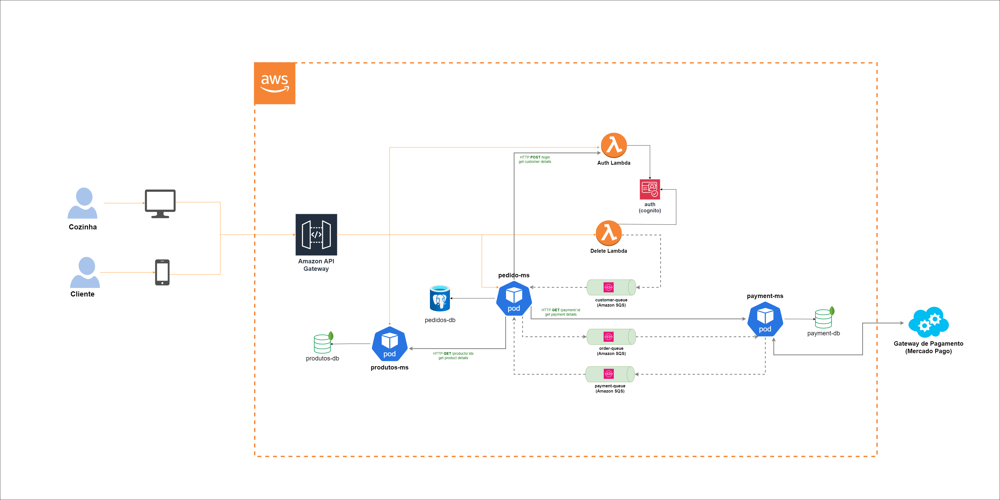

# Totem - Sistema de pedidos

API criada para o tech challenge da Pós Tech FIAP do curso de Arquitetura de Software turma 4SOAT - G60

## Arquitetura




## Iniciando projeto

### [Micro serviço de produtos](https://github.com/4soat-grupo-60/produtos-ms)

Para iniciar esse projeto, após clonar o serviço rode no terminal:

```bash
  cd k8s
```

dentro da pasta /k8s rode no terminal:

```bash
  kubectl apply -f .
```

Acompanhar o status da criação dos PODS

```bash
kubectl get pods --namespace=totem
```

Após todos os pods estarem com o status "Running" seguir para subir o próximo serviço

### [Micro serviço de pedidos](https://github.com/4soat-grupo-60/pedido-ms)

Para iniciar esse projeto, após clonar o serviço rode no terminal:

```bash
  cd k8s
```

dentro da pasta /k8s rode no terminal:

```bash
  kubectl apply -f .
```

Acompanhar o status da criação dos PODS

```bash
kubectl get pods --namespace=totem
```

Após todos os pods estarem com o status "Running" seguir para subir o próximo serviço

### [Micro serviço de pagamentos](https://github.com/4soat-grupo-60/payment-ms)

Para iniciar esse projeto, após clonar o serviço rode no terminal:

```bash
  cd k8s
```

dentro da pasta /k8s rode no terminal:

```bash
  kubectl apply -f .
```

Acompanhar o status da criação dos PODS

```bash
kubectl get pods --namespace=totem
```

### [Lambda de autenticação / registro / remoção](https://github.com/4soat-grupo-60/totem-lambda)

## SAGA

Tipo implementado: Coreografia


### Motivação

O contexto da aplicação é bem simples tendo apenas 3 filas, além disso os serviços possuem todo o contexto para realizar o tratamento completo dos eventos, sem a necessidade e um orquestrador, o que aumentaria a complexidade da solução. E conforme mencionado nas aulas quando o contexto da aplicação é pequeno o indicado é utilizar o padrão SAGA coreografado.

## Análise OWASP
>Não foi necessário realizar nenhum ajuste nos serviços porque não houve nenhum apontamento "High"

#### Listar/exibir cardápio
[Micro serviço de produtos](https://4soat-grupo-60.github.io/produtos-ms/scanner/produtos-report-v2-2024-07-31.html)

#### Realização pedido (Checkout)
[Micro serviço de pedidos](https://4soat-grupo-60.github.io/pedido-ms/scanner/order-request-2024-08-08.html)

#### Geração do Pagamento
[Micro serviço de pagamentos](https://4soat-grupo-60.github.io/payment-ms/scanner/payment-create.html)
#### Confirmação do Pagamento (Webhook)
[Micro serviço de pagamentos](https://4soat-grupo-60.github.io/payment-ms/scanner/payment-confirm.html)

## Funcionalidades

#### Cliente

- Cadastrar cliente
- Buscar clientes por CPF
- Listar todos os clientes
- Cadastrar pedido

#### Pedido

- Buscar pedido por id
- Atualizar status pedido
- Link pedido

#### Fila de pedidos

- Listar pedidos em preparo
- Listar pedidos prontos
- Listar pedidos aguardando preparo

#### Produtos

- Cadastrar produtos
- Buscar produto por categoria
- Listar todos os produtos
- Atualizar produtos
- Apagar produtos
- Processar pagamento

## Vídeo com explicação da arquitetura e projeto rodando

[Youtube](https://www.youtube.com/watch?v=ndtzjphyrJ0)

## Postman

[Postman](https://www.postman.com/lively-escape-385028/workspace/4soat-g60-workspace/request/18248829-e30ebf44-6541-437c-907d-c26be960cd58?tab=body)

## Miro

[Miro](https://miro.com/app/board/uXjVNe6pUU4=/)

## Storytelling

[Storytelling](https://docs.google.com/document/d/1UKt6QM1xacBQHZGV9gy3_L3Li5LpHbLUMzv4UTCF_Nc/edit)

## Draw.io

[Draw.io](https://drive.google.com/file/d/1qGCcjipku3gjhIKb2mjUqF61MDF-eXYg/view?usp=sharing)

## RIPD

[RIPD](https://1drv.ms/w/c/2212ca1d71ab54c7/Ee8_H5k-tp9BkqzgWAq3uuUB4n1KSL7ab9D5Kk5LjMKqBg?e=3hskNa)
